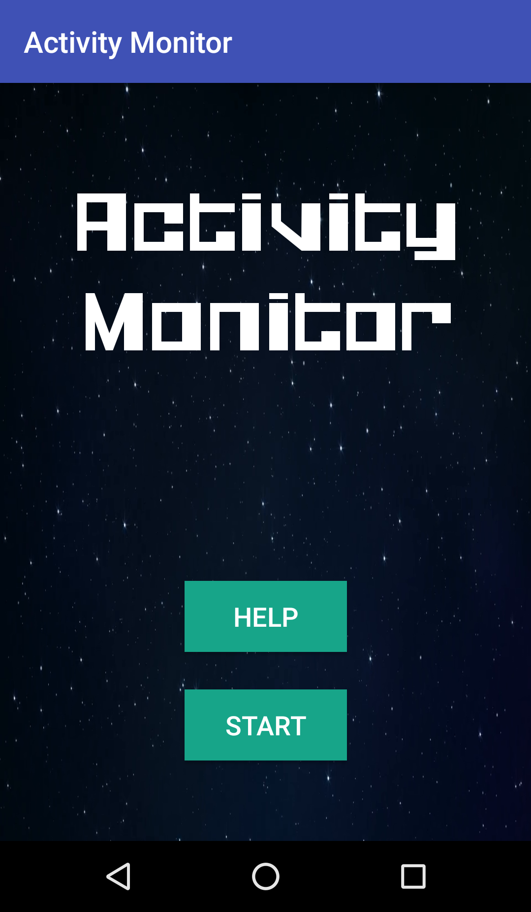
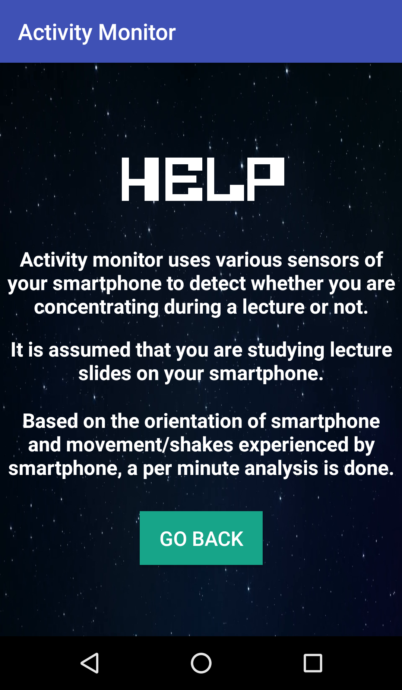
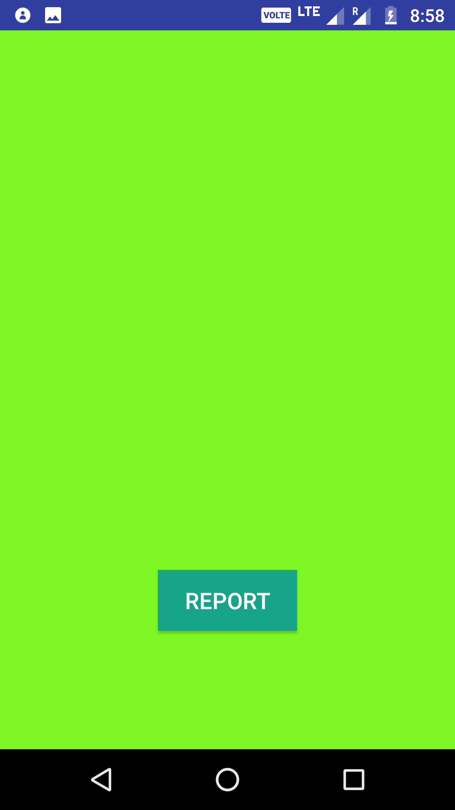
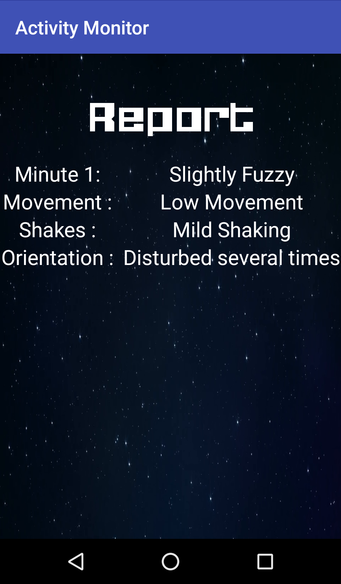
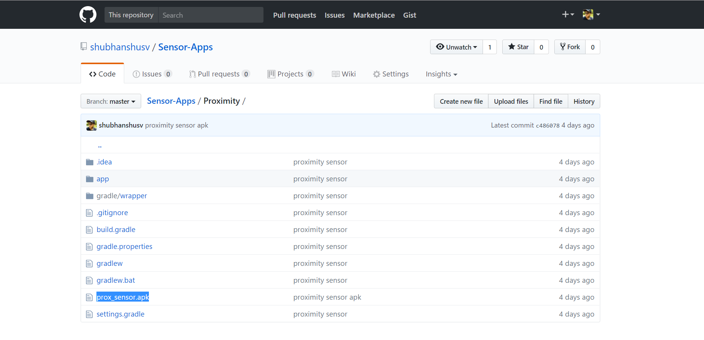
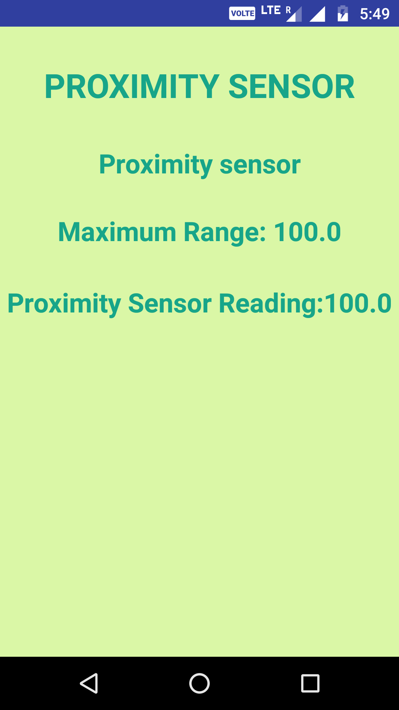

# Sensor-Apps

Android apps related to various smartphone sensors

## 1. Activity Monitor

An app to monitor whether student is paying attention during a lecture or not. The app assumes that student is studying lecture slides during a lecture and lecture slides are dynamically synced with the student's smartphone. Assuming this, the orientation, movement and shaking frequency of smartphone are observed and per minute analysis is done to determine whether student is paying attention in class or not.

###  Working of the app

1. The app uses accelerometer to obtain acceleration of smartphone in different directions. These values are used to detect movement and shakes of smartphone and a condition is imposed to determine whether movement/shakes are low, medium or high.

2. Orientation is calculated using magnetometer and accelerometer values (only accelerometer if magnetometer is not present), and 30-60 degrees is considered ideal position. If this ideal orientation is exceeded, a timer starts and notes the duration for which device was out of orientation. Based on this time, conditions are imposed.

### How to get the app?

1. Visit https://github.com/shubhanshusv/Sensor-Apps/tree/master/Activity%20Monitor%20apk
2. Download the apk and install.

### Overview

1. Home Screen

2. Clicking on help gives you basic objective of the app.

3. Clicking on start button will start the observation process. The color of the screen indicates the concentrarion level of student in the past minute, green indicating focus level high, yellow -> mild ang red -> low.

4. Clicking on report will end the session and give you per minute analysis of your activity.

5. The app can be integrated with a system which syncs lecture slides to the smartphones, and activity of student can be observed during lecture. The teacher can get engagement level of students after the class and pay attention to them accordingly

## 2. Proximity Sensor

A proximity sensor is a sensor able to detect the presence of nearby objects without any physical contact.
 Proximity sensors are commonly used on smartphones to detect (and skip) accidental touchscreen taps when held to the ear during a call.

### How to get the app?

1. Visit https://github.com/shubhanshusv/Sensor-Apps/tree/master/Proximity
2. Download the apk file as highlighted below, and install on an android smartphone.

### Overview

1. After launching the app, the main screen looks like this (landscape mode).

2. The heading (1st line) is just the indicator of which sensor is used.
3. The 2nd line indicates name of proximity sensor of your smartphone.
4. The 3rd line tells the max. value that proximity sensor reading may reach.
5. The 4th line tells the reading of proximity sensor of your smartphone.

- Proximity Sensor is generally located near the front facing camera of the smartphone.
- The reading of proximity Sensor varies from smartphone to smartphone. 
- It generally outputs some values (2-3 different values), which are indicative of distance of object from smartphone.
- For example, In moto g4plus, the reading of proximity sensor is either 1,3 or 100. 1 indicates that object is 1cm away from proximity sensor , similarly 3 indicates 3cm. For distance more than 3cm, it just outputs 100.

